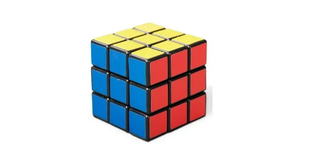
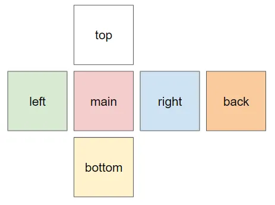

# Rubik's Cube




## Run

```java
public class App {
    public static void main(String[] args) {
        final int size = 2, shuffle_times = 2;

        System.out.println("*****Initialize*****");
        RubiksCube cube = new RubiksCube(size);
        cube.print();

        System.out.printf("*****Shuffling <%s> times*****\n", shuffle_times);
        Shuffler shuffler = new RandomShuffler(shuffle_times);
        shuffler.rotate(cube);

        System.out.println("*****Solving*****");
        Shuffler solver = new RandomSolver();
        int times = solver.rotate(cube);
        System.out.printf("*****Solved after <%s> rotations!*****\n", times);
    }
}

/* output
*****Initialize*****
       [W, W]
       [W, W]
[G, G] [R, R] [B, B] [O, O]
[G, G] [R, R] [B, B] [O, O]
       [Y, Y]
       [Y, Y]

*****Shuffling <2> times*****
<MAIN::0::RIGHT>
       [W, W]
       [W, W]
[O, O] [G, G] [R, R] [B, B]
[G, G] [R, R] [B, B] [O, O]
       [Y, Y]
       [Y, Y]

<LEFT::1::UP>
       [W, O]
       [W, G]
[O, Y] [G, G] [R, W] [B, B]
[G, Y] [R, R] [B, W] [O, O]
       [Y, R]
       [Y, B]

*****Solving*****
<1203> times
<TOP::0::UP>
       [B, B]
       [B, B]
[Y, Y] [O, O] [W, W] [R, R]
[R, R] [Y, Y] [O, O] [W, W]
       [G, G]
       [G, G]
<1204> times

<BACK::1::LEFT>
       [B, B]
       [B, B]
[Y, Y] [O, O] [W, W] [R, R]
[Y, Y] [O, O] [W, W] [R, R]
       [G, G]
       [G, G]
<1205> times
*/
```


## Modeling



### Color
```java
public enum Color {
    W, // white
    G, // green
    O, // orange
    B, // blue
    R, // red
    Y // yellow
}
```

### Side
```java
public enum Side {
    TOP,
    BOTTOM,
    LEFT,
    RIGHT,
    MAIN,
    BACK
}
```

### Face

Container of the rubik's cube side. Contains `n` size of the color array.

```java
class Face {
    public Face(int size, Color color) {
        this(generateNewSide(size, color));
    }

    public Face(Color[][] values) {
        this.values = values;
    }
}
```


### RubiksCube

Container for all sides, methods for rotation etc.

```java
class RubiksCube {
    public RubiksCube(int size) {
        this.size = size;
        this.faces = Map.of(
                Side.TOP, new Face(size, Color.W),
                Side.MAIN, new Face(size, Color.R),
                Side.LEFT, new Face(size, Color.G),
                Side.RIGHT, new Face(size, Color.B),
                Side.BOTTOM, new Face(size, Color.Y),
                Side.BACK, new Face(size, Color.O)
        );
    }
}
```

